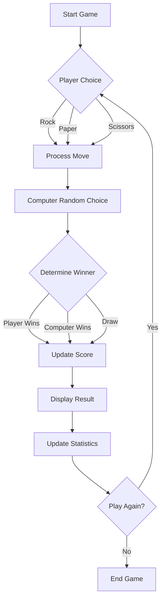
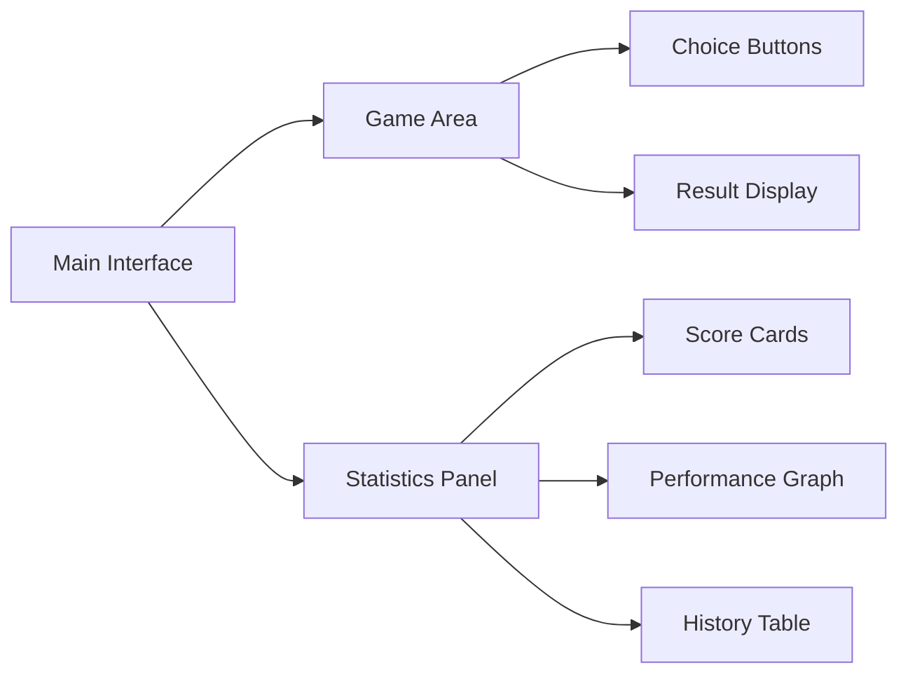

# 🎮 Advanced Rock Paper Scissors Game


A modern, interactive implementation of the classic Rock Paper Scissors game built with Streamlit. Features an engaging UI, real-time animations, and comprehensive game statistics.

## ✨ Features

- 🎯 Interactive and responsive game interface
- 🎨 Beautiful animations and visual effects
- 📊 Real-time game statistics and performance tracking
- 📈 Visual performance graphs
- 🏆 Win/Loss tracking system
- 🔄 Game history recording
- 💫 Engaging countdown animations
- 🎉 Victory celebrations

## 🎯 Game Flow Diagram



## 🛠️ Technical Architecture

```
rock_paper_scissor/
├── main.py              # Main game logic and UI
├── images/              # Game assets
│   ├── rock.png        # Rock gesture image
│   ├── paper.png       # Paper gesture image
│   └── scissor.png     # Scissors gesture image
├── requirements.txt     # Project dependencies
└── README.md           # Project documentation
```

## 🎮 Game Logic

1. **Game Initialization**
   - Set up session state for scores
   - Initialize game variables
   - Prepare UI components

2. **Player Interaction**
   - Player selects move (Rock/Paper/Scissors)
   - Animated countdown begins
   - Computer randomly selects its move

3. **Winner Determination**
   ```python
   WIN_CONDITIONS = {
       "rock": "scissors",
       "paper": "rock",
       "scissors": "paper"
   }
   ```

4. **Score Updates**
   - Track wins, losses, and draws
   - Update statistics in real-time
   - Generate performance visualizations

## 🚀 Getting Started

1. **Clone the repository**
   ```bash
   git clone https://github.com/username/Advance_Rock_Paper_Scissor.git
   cd Advance_Rock_Paper_Scissor
   ```

2. **Set up a virtual environment**
   ```bash
   python -m venv .venv
   source .venv/bin/activate  # On Windows: .venv\Scripts\activate
   ```

3. **Install dependencies**
   ```bash
   pip install -r requirements.txt
   ```

4. **Run the game**
   ```bash
   streamlit run main.py
   ```

## 📊 Features in Detail

### Real-time Statistics
- Win/Loss ratio tracking
- Performance graphs
- Game history recording

### Interactive UI Elements
- Animated buttons
- Visual feedback
- Responsive design

### Game Result Display
- Animated countdown
- Victory/Defeat animations
- Clear visual feedback

## 🎨 UI Components



## 🔧 Dependencies

- **streamlit**: Web application framework
- **pandas**: Data manipulation and analysis
- **matplotlib**: Statistical visualizations
- **random**: Game randomization
- **time**: Animation timing

## 🎯 Future Enhancements

- [ ] Multiplayer mode
- [ ] AI difficulty levels
- [ ] Sound effects
- [ ] Achievement system
- [ ] Online leaderboard
- [ ] Custom themes

## 🤝 Contributing

Contributions are welcome! Please feel free to submit a Pull Request.

## 📝 License

This project is licensed under the MIT License - see the LICENSE file for details.

## 🙏 Acknowledgments

- Streamlit team for the amazing framework
- The open-source community for inspiration
- Game asset creators

---

<div align="center">
Made with ❤️ by Muzaffar Ahmed
</div>
